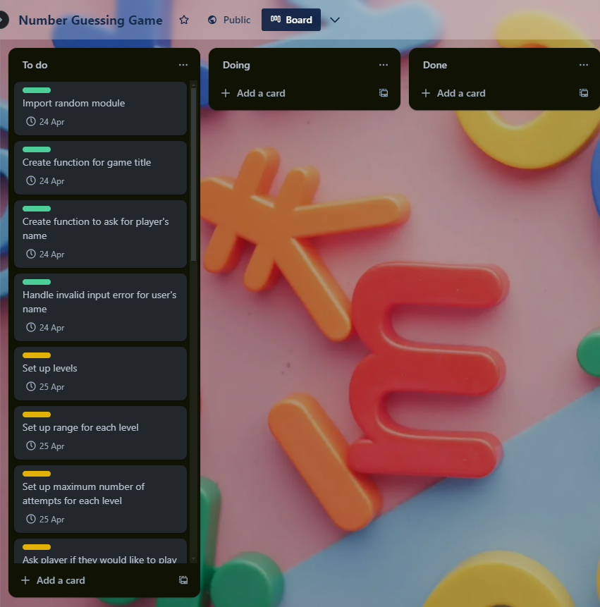
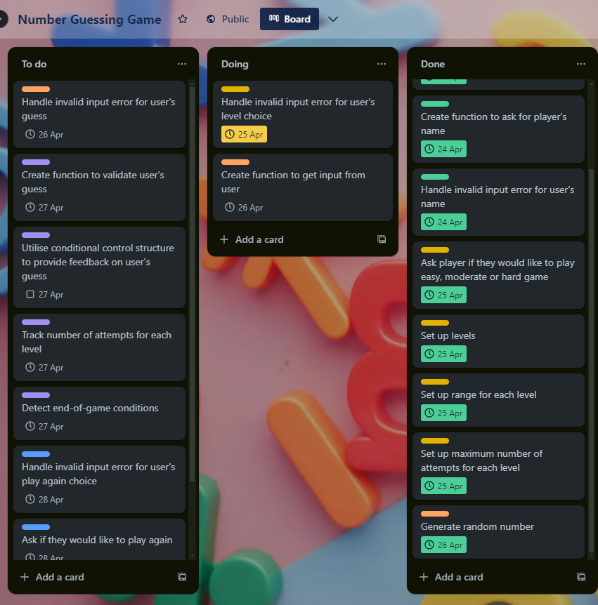
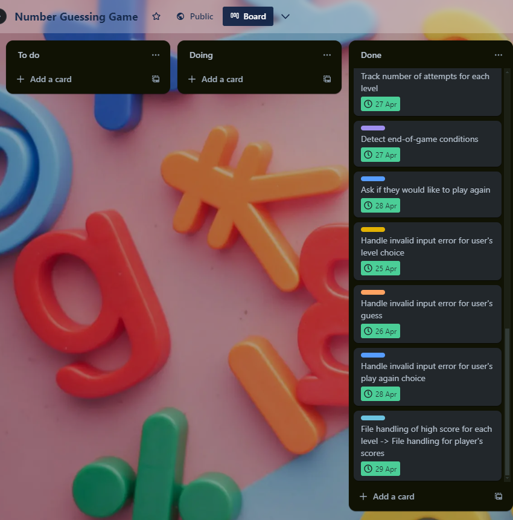

# T1A3: Terminal Application

[Link to GitHub repo](https://github.com/kimnle/T1A3-TerminalApp)

## Code style guide
The application adheres to [PEP 8 style guide for Python code](https://peps.python.org/pep-0008/).

Indentation:

* Uses four spaces per indentation level, consistently aligned with the opening delimiter

Line length:

* Limits all lines to a maximum of 79 characters, improving readability and compatibility with various tools

Blank lines:

* Surrounds top-level functions with two blank lines for clear separation
* Uses blank lines strategically within functions to enhance readability of logical steps

Imports:

* Each import statement occupies a separate line
* Imports are grouped together in order:
    * Standard library imports come first
    * Third-party imports follow
* A blank line separates each import group

Comments:

* Written as complete sentences with proper capitalisation
* Block comments end with a period

Naming convention:

* Variable and funtion names use ```lower_case_with_underscores```
* Exception names follow CapWords convention and are typically suffixed with "Error"

## Features

### Player Name and Greeting

The game prompts the player for their name and handles empty input exceptions. It then greets the player with their name upon successful input.

#### The following three features are created in a function that handles the game logic and puts everything together

### Levels

The game allows players to choose difficulty levels ("easy", "medium", or "hard"). Each level has a specific range for the random number and a set number of attempts allowed. Invalid level selections trigger exceptions.

### Guessing and Validation

Players input guesses within the chosen level's range. The game uses a while loop to continuously prompt for valid input if an invalid guess (strings, floats, etc.) is provided.

### Feedback and Attempts

The game provides feedback on guesses, indicating if they are "higher", "lower", or correct. It tracks the number of attempts used and informs the player of remaining attempts.

### Winning and Score Tracking

Upon a correct guess, the player wins and their score is appended to a CSV file. Pandas is used to read and sort the CSV file (if existing) for displaying player scores like:


### Flowchart


## Implementation Plan

[Link to Trello board](https://trello.com/b/FYOugRYB/number-guessing-game)

I used Trello to manage the overall project and individual tasks related to the feature implementation. Each card outlined the specific tasks needed to complete a particular feature. I assigned due dates to tasks and used labels to group related tasks together for efficient feature completion. I captured screenshots of the Trello board during development for reference in the docs folder.





The second screenshot shows priorisation of tasks with later due dates over an outstanding task with an earlier due date. I realised during development that implementing features first then adding exception handling was a more efficient approach as it first allowed me to establish the core logic of the game and ensure it functioned as intended for later incorporating exception handling.

## Help Documentation

### Prerequisites

Ensure you have [Python](https://www.python.org/downloads/) installed on your system before proceeding.

### Dependencies

The game utilises several external libraries:

* colored==2.2.4
* numpy==1.26.4
* pandas==2.2.2
* python-dateutil==2.9.0.post0
* pytz==2024.1
* six==1.16.0
* tzdata==2024.1

These dependencies are automatically installed when you run the provided script.

### Running the Game

1. Clone the repository:

Open your preferred terminal application.

Navigate to a directory where you want to clone the project.

Run the following command:

```git clone git@github.com:kimnle/T1A3-TerminalApp.git```

This will clone the project repository into a folder named "T1A3-TerminalApp".

2. Change directory:

Navigate to the "src" directory within the cloned repository:

```cd T1A3-TerminalApp/src```

3. Grant permission:

Grant execution permissions to the "run.sh" script:

```chmod +x run.sh```

4. Run the game:

Execute the "run.sh" script:

```./run.sh```

This will launch the Guess the Number Game.